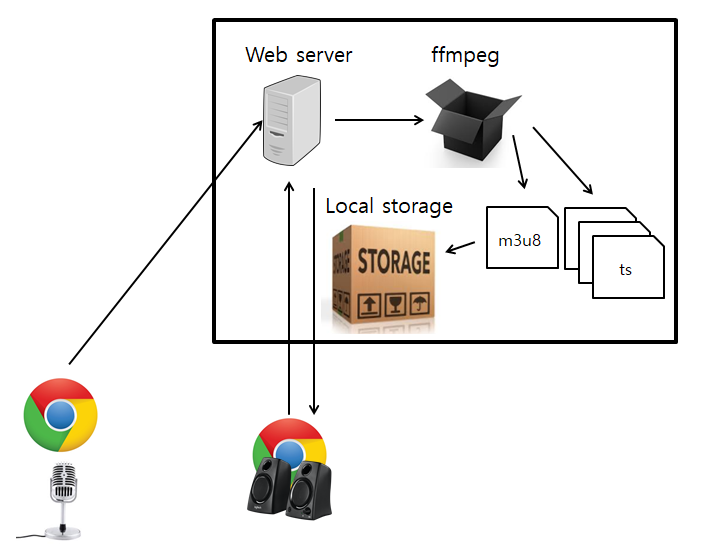

# hls-service
Nodejs로 작성된 HLS(HTTP Live Streaming) 서비스입니다.


## 1. 개발, 테스트 환경 및 의존성
- Windows 10
- Nodejs v8.9.4
- ffmpeg
- 구글 크롬 브라우저

ffmpeg는 빌드된 cli 바이너리를 설치하여 Path 경로에 위치시켜야 합니다.
## 2. 실행방법

```
npm install
npm start
```

## 3. 기능 및 간단 사용법

현재 가능한 기능은 다음과 같습니다.
1. 웹 브라우저에서 마이크 API를 통한 음성 방송 송출
2. 웹 브라우저에서, 송출된 방송을 실시간으로 청취 (약간의 Latency 있음)

여러명의 동시 방송 송출은 아직 지원하지 않습니다.

## 4. 심플 아키텍쳐
    

### 1. 브로드캐스팅 클라이언트
방송 송출자는, 웹 브라우저를 통해 송출 페이지로 접속한다. 접속한 이후 장치에 있는 마이크를 통해 음성을 녹음한 뒤, 특정 길이가 될 때 마다 서버로 전송한다. 전송된 음성 데이터는 웹 서버로 전송되며, 웹 서버는 해당 데이터를 ffmpeg을 통해 MPEG-transport stream으로 인코딩하고 적당한 크기의 세그먼트로 자른다. 이 결과물은 \*.m3u8 파일과 \*.ts  파일이다. 이 파일들을 로컬 스토리지에 저장한다.

### 2. 리스닝 클라이언트
방송 청취자는 HLS 클라이언트 라이브러리를 통해서 HLS를 스트리밍 재생한다. 내부적으로 마스터 플레이 리스트를 받아와서  방송 스트림을 지속적으로 요청하여 리스트를 업데이트 한다. 이후 세그먼트 데이터들을 요청해서 클라이언트에 캐싱 후 재생을 하며, 클라이언트 사이드에서 재생 속도와 데이터 요청 속도를 적절히 조절하여 데이터를 버퍼에 저장해놓고 재생한다.

## 5. 레퍼런스

[Apple HLS Documents](https://developer.apple.com/library/content/documentation/NetworkingInternet/Conceptual/StreamingMediaGuide/HTTPStreamingArchitecture/HTTPStreamingArchitecture.html)    
[LiveStreaming Implements by Nodejs](https://github.com/mjrusso/livestreaming-js)    
[HLS client implemented with javascript](https://github.com/video-dev/hls.js)    
[Document about live streaming by MDN](https://developer.mozilla.org/en-US/Apps/Fundamentals/Audio_and_video_delivery/Live_streaming_web_audio_and_video)    
[Browser level Mic access API example](https://developers.google.com/web/fundamentals/media/recording-audio/?hl=ko)    
[MediaRecorder API in web browser by MDN](https://developer.mozilla.org/ko/docs/Web/API/MediaRecorder)    
[HLS spec on RFC](https://tools.ietf.org/html/rfc8216)    
[Javscript HLS Client](https://github.com/video-dev/hls.js/)    
